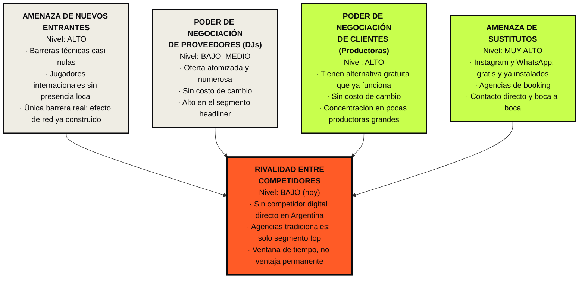

# §4B — Análisis del microentorno: las cinco fuerzas de Porter

*Extensión pautada: 2–3 carillas, presentado en diagrama · Beatmatch*

> **Nota de verificación.** Esta sección es mayormente **análisis propio** sobre un mercado del que no existe estadística pública, así que depende menos de fuente secundaria que el PESTEL. Las marcas `[V-##]` señalan los pocos datos externos que sí requieren verificación. Las afirmaciones sobre cómo opera hoy el mercado deben quedar respaldadas por las **entrevistas de §5A**, citadas como (E1), (E2), (E3) — no por intuición del equipo.

---

## Advertencia metodológica: ¿de quién es el sector?

Antes de aplicar el modelo hay que resolver algo que la mayoría de los trabajos saltea: **Porter analiza la rentabilidad de un sector, y Beatmatch no compite en el sector de la música, sino en el de la intermediación de servicios artísticos.**

La distinción cambia todas las respuestas:

| Si se define el sector como… | Los proveedores son… | Los clientes son… |
|---|---|---|
| ❌ Servicios de DJ | Los DJs | Las productoras |
| ✅ **Intermediación digital de contratación de DJs** | **Los DJs** (aportan el inventario) | **Las productoras** (pagan la comisión) |

Además, Beatmatch es un **mercado de dos lados**, y ahí el modelo clásico se queda corto: los DJs son simultáneamente proveedores del inventario y usuarios del producto. El análisis lo trata explícitamente, porque es una particularidad estructural del negocio y señalarla suma.

---

## Diagrama

> **Para la entrega:** este diagrama está en Mermaid para poder versionarlo. La consigna pide el análisis presentado en diagrama, así que conviene rehacerlo en **Figma o Canva** con la identidad visual de Beatmatch (naranja `#FF5B26`, verde lima `#C8FF4D`, negro `#0A0A0D`) y exportarlo como imagen. Las imágenes no cuentan para el límite de carillas.

---

## 1. Amenaza de nuevos entrantes — **ALTA**

**Barreras de entrada, una por una:**

| Barrera | ¿Protege a Beatmatch? |
|---|---|
| Capital inicial | **No.** El stack del MVP corre en niveles gratuitos; el costo mensual proyectado es cercano a cero. |
| Tecnología | **No.** Un directorio con buscador y formulario de contacto es tecnología estándar. |
| Regulación / licencias | **No.** No hay licencia habilitante para intermediar. |
| Economías de escala | **No** en la etapa inicial. |
| Marca | **Débil.** La marca existe y está bien construida, pero sin reconocimiento acumulado en el mercado. |
| **Efecto de red** | **Sí — y es la única real.** |

**El análisis.** La única barrera defendible es el **efecto de red**: una plataforma con 300 DJs cargados y productoras activas es sustancialmente más valiosa que una vacía, y esa base no se copia. Pero el efecto de red **todavía no existe**: Beatmatch está en Fase 01 justamente construyéndolo. Hoy la empresa no tiene ninguna barrera de entrada operativa.

De ahí se desprende la consecuencia estratégica más importante del análisis: **la ventaja de Beatmatch es temporal y se mide en velocidad de ejecución.** Las metas del plan de producto —150 a 300 DJs cargados antes de abrir el buscador— no son una meta de vanidad: son la construcción de la única barrera de entrada que el negocio va a tener.

**Riesgo específico.** Existen plataformas internacionales con el modelo ya validado (Djaayz, AGNT, DJClub.pro, Songlive) que no operan en Argentina. `[V-20]` Si alguna decide entrar, llega con producto probado y capital. La defensa no es tecnológica sino de conocimiento local: verificación de perfiles reales de la escena, precios en pesos, comprensión de los códigos del mercado argentino.

---

## 2. Poder de negociación de los proveedores (DJs) — **BAJO a MEDIO**

En este marketplace, el "proveedor" es quien aporta el inventario: los DJs.

**Por qué es bajo:**
- **Oferta atomizada.** Miles de DJs activos, ninguno indispensable.
- **Sin costo de cambio.** Estar en Beatmatch no impide estar en otro lado; el DJ no entrega exclusividad.
- **Interés alineado.** Aportan su perfil a cambio de visibilidad gratuita. En Fases 01 y 02 no hay negociación económica, así que no hay tensión de precio.
- **Sin capacidad de acción colectiva.** No hay sindicato ni cámara de DJs con poder de negociación frente a plataformas.

**Por qué no es tan bajo como parece:**
- **Asimetría por segmento.** El DJ headliner tiene alto poder: su presencia da prestigio a la plataforma y él no necesita a Beatmatch. Beatmatch no va a poder atraerlo en la etapa inicial, y **no debería intentarlo** — su segmento es el emergente y el medio, que es donde el dolor es real.
- **Riesgo de calidad, no de precio.** El poder del proveedor acá no se ejerce sobre el precio sino sobre la calidad del inventario: perfiles a medio completar, datos desactualizados, DJs que no responden. Esto degrada el producto sin que haya negociación de por medio.
- **En Fase 03 esto cambia.** Cuando haya comisión, el DJ empieza a evaluar si la plataforma justifica su costo, y su poder aumenta.

---

## 3. Poder de negociación de los clientes (productoras) — **ALTO**

**Por qué es alto:**
- **Tienen una alternativa gratuita que ya les funciona.** Instagram y WhatsApp no les cobran nada. Beatmatch no compite contra otra plataforma: compite contra un método instalado, gratuito y con el que la productora ya resuelve el problema, mal pero lo resuelve.
- **Sin costo de cambio.** Pueden irse en cualquier momento sin perder nada.
- **Concentración relativa.** Pocas productoras grandes concentran una porción alta de los eventos: perder una pesa mucho más que perder un DJ.
- **Sensibilidad al precio de la comisión.** Una comisión sobre el caché es un costo nuevo sobre algo que hoy consiguen gratis. La disposición a pagar tiene que validarse en campo, no suponerse.
- **Amenaza de desintermediación permanente.** Se conocen en la plataforma y cierran por fuera. Es estructural en todo marketplace de servicios.

**Consecuencia estratégica.** El poder alto del cliente es **la razón por la que no se cobra en Fases 01 y 02**. Cobrarle a quien tiene una alternativa gratuita, antes de haberle demostrado valor, garantiza el fracaso. La comisión solo es defendible cuando la plataforma aporte algo que WhatsApp no puede: seña protegida, historial verificable, reviews bidireccionales y respaldo ante incumplimiento. Es decir: **el poder del cliente define el momento de la monetización, no solo su precio.**

---

## 4. Amenaza de productos sustitutos — **MUY ALTA**

*Es la fuerza más intensa del sector y la que hay que tratar con más honestidad. Un trabajo que minimiza a sus sustitutos pierde credibilidad entera.*

| Sustituto | Cómo compite | Por qué gana hoy | Cómo se lo enfrenta |
|---|---|---|---|
| **Instagram + WhatsApp** | Es el método actual del 100% del mercado | Gratis, universal, ya instalado, cero fricción de adopción | No se lo reemplaza: se lo complementa. Beatmatch aporta **descubrimiento** (encontrar a quien no conocés), que es exactamente lo que Instagram no hace bien |
| **Agencias de booking** | Intermediación profesional tradicional | Confianza, curaduría, relación establecida | Atienden solo el segmento top. El emergente y el medio quedan desatendidos: ahí está el mercado |
| **Contacto directo / boca a boca** | Red personal del productor | Confianza máxima, costo cero | Solo funciona dentro de la red conocida. Su límite *es* la oportunidad |
| **Grupos de WhatsApp de la escena** | Difusión de búsquedas | Inmediatez, comunidad | Sin filtros, sin historial, sin verificación. Se pierde el mensaje entre 200 más |
| **Que el DJ sea del propio equipo** | Integración vertical del organizador | Costo cero | Limita el line-up. Aplica a productoras chicas |

**El análisis.** El competidor real de Beatmatch no es otra plataforma: **es un hábito**. Y los hábitos gratuitos, arraigados y que funcionan razonablemente bien son los rivales más difíciles de desplazar, porque no hay que ganarles en producto sino en costo de cambio.

De acá sale la definición del posicionamiento (§6A): Beatmatch no se posiciona como reemplazo de Instagram, sino como **la capa de descubrimiento y confianza que Instagram nunca fue**. La productora va a seguir cerrando por WhatsApp durante mucho tiempo; el valor de Beatmatch está aguas arriba, en el momento de *encontrar* y *evaluar*, no en el de cerrar.

---

## 5. Rivalidad entre competidores existentes — **BAJA (hoy)**

**Por qué es baja:**
- No hay ninguna plataforma digital de booking de DJs operando en Argentina. `[V-21]`
- Los referentes internacionales validaron el modelo pero no tienen presencia local. `[V-20]`
- Las agencias tradicionales no compiten por el mismo segmento.

**Por qué esto no es tan buena noticia como parece.** La rivalidad baja en un mercado sin barreras de entrada no es una ventaja competitiva: es una **ventana de tiempo**. Y hay una lectura alternativa que el trabajo tiene que enfrentar en vez de esquivar: *¿por qué nadie lo hizo todavía?*

Tres explicaciones posibles, y las tres deben contrastarse en el trabajo de campo (§5A, pregunta E3-13):
1. **El mercado es demasiado chico** para sostener un intermediario digital.
2. **Se intentó y falló** — hubo intentos previos que no prosperaron.
3. **La ventana recién se abre ahora** — la digitalización de pagos y la maduración del mercado hacen viable hoy lo que antes no lo era.

Si el trabajo asume la tercera sin descartar las dos primeras, está haciendo un acto de fe. La entrevista al especialista es el instrumento que resuelve esto.

---

## Síntesis: atractivo del sector

| Fuerza | Intensidad | Efecto sobre la rentabilidad |
|---|---|---|
| Nuevos entrantes | 🔴 Alta | Negativo |
| Proveedores (DJs) | 🟢 Baja–Media | Positivo |
| Clientes (productoras) | 🔴 Alta | Negativo |
| Sustitutos | 🔴 Muy alta | Negativo |
| Rivalidad actual | 🟢 Baja | Positivo |

**Conclusión.** El sector presenta un **atractivo estructural moderado a bajo**: tres de las cinco fuerzas juegan en contra, y las dos favorables son transitorias —la rivalidad baja se acaba cuando alguien más entre, y el poder bajo de los proveedores aumenta cuando se empiece a cobrar comisión.

Decir esto en un plan de negocios parece contraproducente. No lo es: **un sector con atractivo bajo y una ventana abierta es exactamente la situación en la que un emprendedor sin capital puede competir**. Si el sector fuera estructuralmente atractivo, ya habría jugadores establecidos con recursos.

Las tres condiciones que se desprenden de este análisis y que atraviesan todo el resto del Plan:

1. **Velocidad.** Construir el efecto de red antes de que aparezca competencia. Es la única barrera disponible.
2. **Diferenciación funcional frente al sustituto.** Beatmatch tiene que hacer algo que WhatsApp no puede hacer —descubrimiento, verificación, historial, seña protegida—, no hacer lo mismo con mejor diseño.
3. **Paciencia en la monetización.** El poder alto del cliente y la fuerza del sustituto gratuito determinan que cobrar temprano destruye la red antes de que exista.

---

## Notas para la redacción final

- Comprimir a 2–3 carillas. Se recorta primero la advertencia metodológica inicial (que igual conviene dejar en 3 líneas: demuestra criterio) y se conservan íntegras las **conclusiones** de cada fuerza.
- Rehacer el diagrama en Figma/Canva con la identidad de marca y exportarlo como imagen.
- Cada afirmación sobre el funcionamiento actual del mercado debe quedar referenciada a (E1), (E2) o (E3) una vez hechas las entrevistas. **Hoy no lo está**, y es la principal deuda de esta sección.
