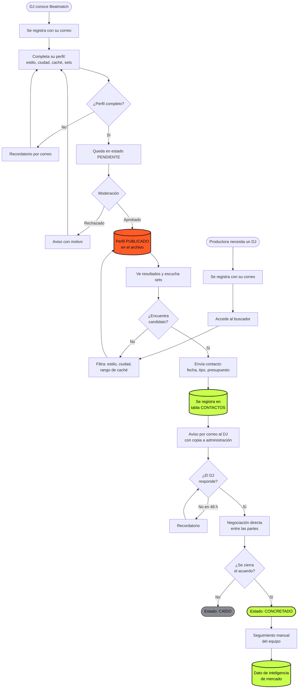
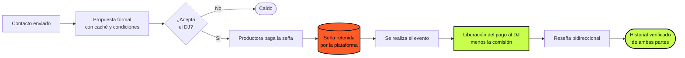

# §7 — Estudio técnico

*Extensión pautada: §7A requerimientos 1–2 carillas · §7B diagrama de flujo del servicio 1–2 carillas · Beatmatch*

> **Nota.** Esta sección es de elaboración propia a partir del plan de producto del equipo. No requiere fuentes secundarias, salvo los precios de los servicios contratados, que sí hay que verificar en la web de cada proveedor y consignar con fecha `[V-##]`.
>
> **Aclaración importante para la consigna:** la guía pide un Bill of Materials (BOM) o listado de materiales. **Beatmatch no produce un bien físico**, por lo que el BOM no aplica. Se lo reemplaza por un **listado de requerimientos técnicos y de servicios**, y el diagrama de proceso productivo se reemplaza por el **diagrama de flujo del servicio**. Conviene explicitar esta adaptación en el trabajo en lugar de forzar un BOM inexistente: demuestra comprensión del modelo, y es la adaptación estándar para negocios de servicios.

---

# §7A — Requerimientos técnicos

## 1. Requerimientos de infraestructura tecnológica

| Componente | Solución adoptada | Función | Costo mensual MVP | Costo al escalar | Verif. |
|---|---|---|---|---|---|
| Framework de aplicación | Next.js 15 (App Router) | Frontend y backend en un solo proyecto; renderizado en servidor para indexación de perfiles públicos | USD 0 (open source) | USD 0 | — |
| Base de datos | Supabase (PostgreSQL) | Almacenamiento de perfiles, contactos y favoritos | USD 0 (nivel gratuito) | ~USD 25/mes | `[V-22]` |
| Autenticación | Supabase Auth (magic link) | Registro e ingreso sin gestión de contraseñas | Incluido | Incluido | `[V-22]` |
| Almacenamiento de archivos | Supabase Storage | Fotos de perfil de los DJs | Incluido hasta 1 GB | Según uso | `[V-22]` |
| Hosting y despliegue | Vercel | Publicación, CDN, despliegue automático desde el repositorio | USD 0 (nivel Hobby) | ~USD 20/mes | `[V-23]` |
| Correo transaccional | Resend | Avisos de contacto y correos de bienvenida | USD 0 (hasta 3.000/mes) | ~USD 20/mes | `[V-24]` |
| Dominio | `.com.ar` o `.ar` | Identidad e indexación | ~USD 10–25/año | igual | `[V-25]` |
| Analítica | Plausible / Umami | Métricas de uso sin cookies | USD 0–9/mes | igual | `[V-26]` |
| Control de versiones | GitHub | Repositorio y respaldo del código | USD 0 | USD 0 | — |
| Diseño | Figma | Prototipos, diagramas y piezas de marca | USD 0 (plan educativo) | igual | `[V-27]` |

**Costo tecnológico total del MVP: USD 0 mensuales**, más el dominio anual.

> ⚠️ **Los precios de los niveles gratuitos cambian.** Hay que verificarlos en la web oficial de cada proveedor a la fecha del trabajo y consignar esa fecha. Un cuadro de costos sin fecha de relevamiento no es verificable.

**Lectura económica del cuadro.** El costo tecnológico es prácticamente nulo, y eso es un hallazgo relevante para el plan financiero (§9): **la inversión inicial de Beatmatch no es de capital sino de tiempo**. El punto de equilibrio no se define por costos de infraestructura sino por el costo de oportunidad de las horas del equipo. El riesgo del proyecto tampoco es financiero: es de ejecución.

---

## 2. Requerimientos funcionales del sistema

Alcance del MVP (Fase 02). Se listan también las exclusiones, porque **definir qué no se construye es tan parte del estudio técnico como definir qué sí**.

### Incluido en el MVP

| # | Requerimiento | Descripción | Prioridad |
|---|---|---|---|
| RF-01 | Registro y autenticación | Alta por enlace mágico al correo, con elección de rol (DJ / productora) | Alta |
| RF-02 | Perfil de DJ | Nombre artístico, foto, biografía, estilos (multiselección), ciudad, rango de caché, enlaces a sets, requerimientos técnicos | Alta |
| RF-03 | Perfil público con URL propia | `beatmatch.ar/dj/[nombre]`, indexable y compartible como presskit | Alta |
| RF-04 | Buscador con filtros | Por estilo, ciudad y rango de caché; resultados en tarjetas | Alta |
| RF-05 | Formulario de contacto | Fecha, tipo de evento, presupuesto y mensaje; se guarda y se notifica por correo | Alta |
| RF-06 | Moderación de perfiles | Estado pendiente → publicado, con aprobación manual | Alta |
| RF-07 | Panel del usuario | DJ edita su perfil y ve contactos recibidos; productora ve los enviados | Media |
| RF-08 | Favoritos | La productora guarda DJs de interés | Baja |
| RF-09 | Consentimiento de datos | Casilla de aceptación de política de privacidad en el registro | **Alta** |

> **RF-09 es una deuda del producto actual.** El formulario de la Fase 04 ya en línea capta nombre, apellido, fecha de nacimiento y enlaces sin casilla de consentimiento ni política de privacidad publicada. Es una obligación legal (§4A, factor Legal) y su costo de resolución es bajo. Conviene señalarlo en el trabajo como acción correctiva identificada por el propio análisis: muestra que el estudio técnico sirvió para algo.

### Excluido del MVP y por qué

| Excluido | Razón |
|---|---|
| Chat en tiempo real | El correo alcanza para validar. Un chat vacío transmite sensación de producto abandonado |
| Calendario de disponibilidad | Los DJs no lo mantendrían actualizado; el campo "fecha del evento" del formulario resuelve lo mismo |
| Pagos en plataforma | Corresponde a Fase 03 |
| Sistema de reseñas | Sin bookings concretados no hay qué reseñar |
| Aplicación móvil nativa | La web responsiva cubre el caso de uso; el tráfico será mayoritariamente móvil pero por navegador |
| Recomendación automática | Requiere datos históricos de qué contrata quién. Primero búsqueda manual |

---

## 3. Requerimientos no funcionales

| Tipo | Requerimiento | Justificación |
|---|---|---|
| Rendimiento | Carga inicial < 3 s en conexión móvil | El uso será mayoritariamente por celular (§4A, factor Tecnológico) |
| Diseño adaptativo | Funcional desde 360 px de ancho | Idem |
| Disponibilidad | ≥ 99% mensual | Cubierto por los proveedores contratados |
| Seguridad | Seguridad a nivel de fila en base de datos: cada DJ edita solo su perfil | Requisito de integridad de datos |
| Privacidad | Datos personales cifrados; caché visible solo para usuarios registrados | Ley 25.326 e incentivo al registro |
| Indexación | Metadatos y Open Graph por perfil | El perfil público como presskit compartible es un motor de adopción |
| Accesibilidad | Contraste AA, navegación por teclado | Buena práctica y requisito de calidad |
| Escalabilidad | Soportar 5.000 perfiles sin rediseño | Meta a 3 años (§6B) |

---

## 4. Requerimientos humanos

| Rol | Dedicación | Cubierto por | Costo |
|---|---|---|---|
| Desarrollo y producto | ~15 h/semana | Equipo emprendedor | Costo de oportunidad |
| Diseño y marca | ~5 h/semana | Equipo emprendedor | Costo de oportunidad |
| Moderación de perfiles | ~3 h/semana | Equipo emprendedor | Costo de oportunidad |
| Reclutamiento de DJs y contenidos | ~8 h/semana | Equipo emprendedor | Costo de oportunidad |
| Atención y seguimiento de contactos | ~4 h/semana | Equipo emprendedor | Costo de oportunidad |

> Completar con los nombres y la asignación real una vez definido §4C (análisis del equipo emprendedor). **La estimación horaria total —unas 35 h semanales repartidas— es el dato que hay que llevar al plan financiero:** es la inversión real del proyecto, y omitirla haría parecer que Beatmatch no cuesta nada.

---

## 5. Requerimientos de infraestructura física

Beatmatch opera de forma remota y no requiere local comercial, depósito ni logística. Los requerimientos se limitan a equipamiento propio del equipo (computadoras personales y conectividad), ya disponible y sin inversión incremental.

**Esta ausencia de activos fijos es una característica estructural del modelo**, no una omisión del análisis: reduce la inversión inicial casi a cero, elimina costos fijos de alquiler y servicios, y explica por qué el punto de equilibrio del negocio depende del volumen de transacciones y no de la cobertura de una estructura.

---

# §7B — Diagrama de flujo del servicio

## 1. Flujo principal: del registro al booking

---

## 2. Lectura del diagrama

**Dos flujos que convergen en un punto.** El diagrama muestra los dos lados del mercado como recorridos independientes que se encuentran en el archivo de perfiles publicados. Esto hace visible el **problema del huevo y la gallina**: si el flujo de la izquierda no produce suficientes perfiles publicados, el de la derecha se interrumpe en "no encuentra candidato" y la productora abandona. Es la justificación operativa de secuenciar las fases —construir oferta antes de abrir la búsqueda— y de las metas de 150 a 300 DJs cargados antes de la Fase 02.

**El único punto de control de calidad es la moderación.** Al no haber producto físico, no hay control de calidad sobre un bien: el equivalente funcional es la aprobación manual del perfil. Es también el único paso que no escala, y por eso el plan de producto contempla reemplazarlo por verificación automatizada más curaduría por excepción cuando el volumen lo exija.

**El proceso no termina en el acuerdo.** El tramo final —seguimiento manual, actualización del estado del contacto— no le entrega valor al usuario: **le entrega inteligencia de mercado a la empresa**. Es lo que permite conocer quién contrata a quién, a qué precio y para qué tipo de evento. Ese registro es la base sobre la que se diseña la comisión de la Fase 03: sin él, no hay forma de fijar un porcentaje con fundamento. Por eso el plan de producto identifica a `contactos` como la tabla más valiosa del sistema.

**Los reintentos son parte del diseño.** Los ciclos de recordatorio (perfil incompleto, DJ que no responde) no son manejo de errores: son los dos puntos donde el servicio se cae en la práctica. Explicitarlos en el diagrama es lo que distingue un flujo real de un diagrama de folleto.

---

## 3. Puntos críticos del proceso

| # | Punto | Riesgo | Mitigación |
|---|---|---|---|
| 1 | Completar el perfil | El DJ se registra y abandona antes de terminar | Barra de progreso; perfil público como presskit compartible (incentivo propio); recordatorio por correo |
| 2 | Moderación | Cuello de botella manual; demora desalienta | Objetivo de 24 h; verificación automática de enlaces |
| 3 | Búsqueda sin resultados | Sin densidad de oferta, la productora se va y no vuelve | No abrir Fase 02 antes de la masa crítica; concierge manual al inicio |
| 4 | Respuesta del DJ | Si no responde, la productora vuelve a WhatsApp | Recordatorio a 48 h; indicador de tasa de respuesta en el perfil |
| 5 | Cierre fuera de la plataforma | Desintermediación: el equipo pierde el dato del resultado | Aceptada en Fases 01–02. Se mitiga con seguimiento manual y, en Fase 03, con valor real dentro de la plataforma (seña protegida, reseñas, historial) |

---

## 4. Evolución del flujo en la Fase 03

Para mostrar que el diseño del servicio contempla la etapa monetizable, el flujo se extiende así:

**La retención de la seña es el mecanismo que resuelve simultáneamente los tres problemas de confianza del mercado** relevados en el análisis: el DJ que no se presenta, la productora que no paga, y la desintermediación. Es el momento en que la plataforma pasa de ser un directorio a ser infraestructura de la transacción — y es también el momento en que empieza a poder cobrar, porque recién ahí aporta algo que WhatsApp no puede replicar.

---

## Notas para la redacción final

- Rehacer ambos diagramas en Figma con la identidad de marca y exportarlos como imagen (no cuentan para el límite de carillas).
- Verificar y fechar todos los precios de servicios `[V-22]` a `[V-27]`.
- Completar el cuadro de requerimientos humanos con los integrantes reales una vez cerrado §4C.
- Las horas semanales estimadas tienen que viajar a §9 como costo de mano de obra del equipo, aunque no se remunere en el año 1. Un plan que valúa en cero el trabajo de sus fundadores está mal hecho.
